1. Используя команду **cat** в терминале операционной системы **Linux**, создать два файла: 
    * *Домашние животные* (заполнив его собаками, кошками, хомяками),
    * *Вьючные животные* (заполнив - лошадьми, верблюдами и ослами), <br> 
    а затем объединить их. <br>

    Просмотреть содержимое созданного файла. <br>
    Переименовать файл, дав ему новое имя - *Друзья человека*.

```
cat > 'Домашние животные'
cat > 'Вьючные животные'
cat 'Домашние животные' 'Вьючные животные' > 'Животные'
cat Животные
mv Животные 'Друзья человека'
```

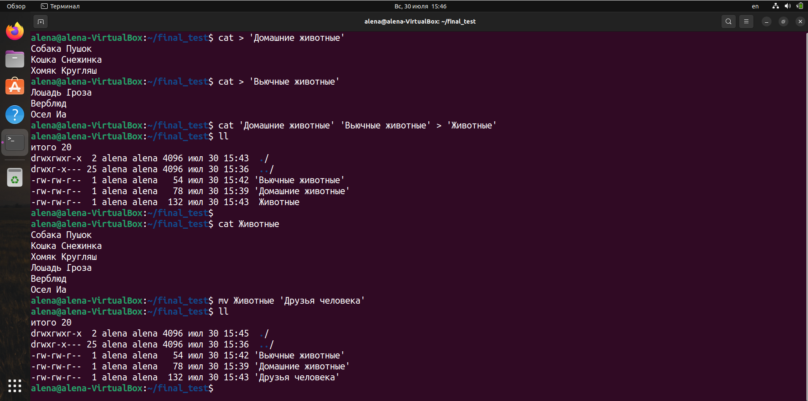

***

2. Создать директорию, переместить файл туда.

```
mkdir animals
mv 'Друзья человека' animals/
```

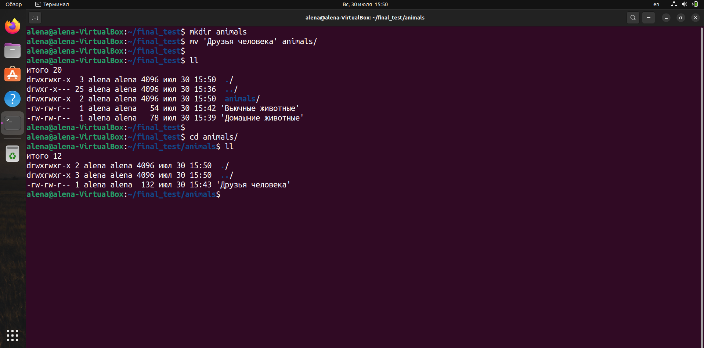

***

3. Подключить дополнительный репозиторий MySQL. Установить любой пакет из этого репозитория. <br>
*Установка репозитория проводилась согласно инструкции на сайте:* <br> 
https://dev.mysql.com/doc/mysql-apt-repo-quick-guide/en/

```
wget https://dev.mysql.com/get/mysql-apt-config_0.8.26-1_all.deb
sudo dpkg -i mysql-apt-config_0.8.26-1_all.deb
sudo apt-get update
sudo apt install mysql-server
systemctl status mysql
```

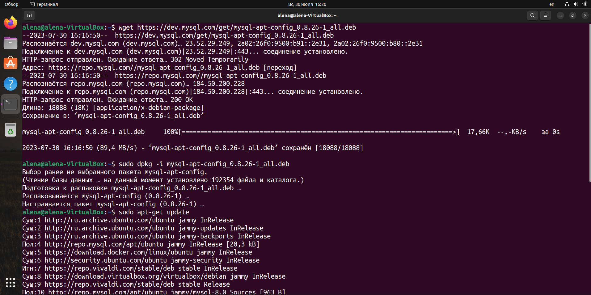

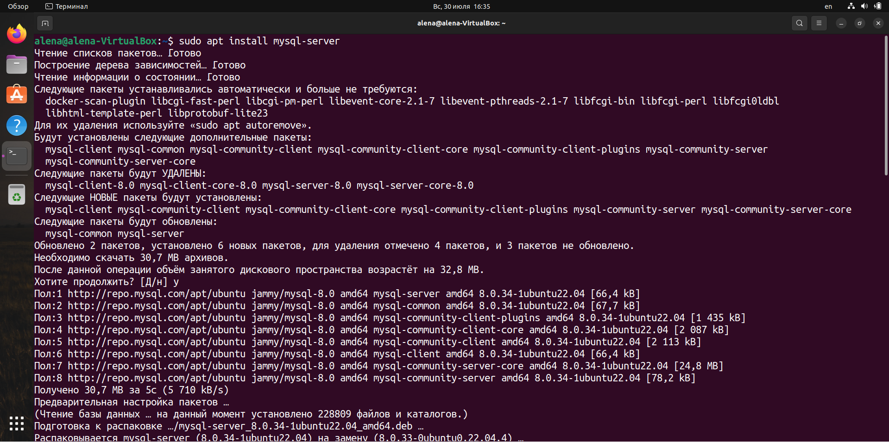

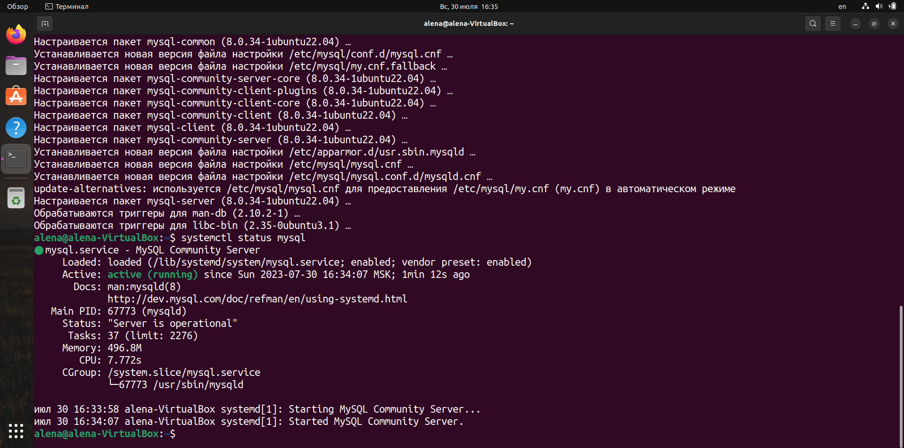

***

4. Установить и удалить deb-пакет с помощью **dpkg**.

```
wget https://downloads.vivaldi.com/stable/vivaldi-stable_6.1.3035.204-1_amd64.deb
sudo dpkg -i vivaldi-stable_6.1.3035.204-1_amd64.deb
sudo apt update
sudo dpkg -r vivaldi-stable
```

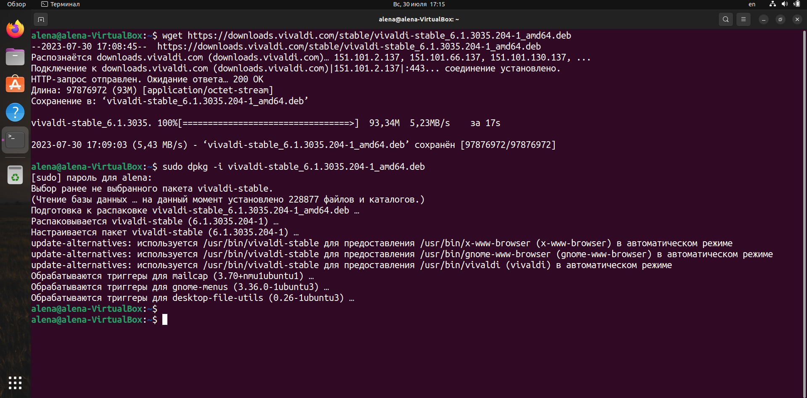

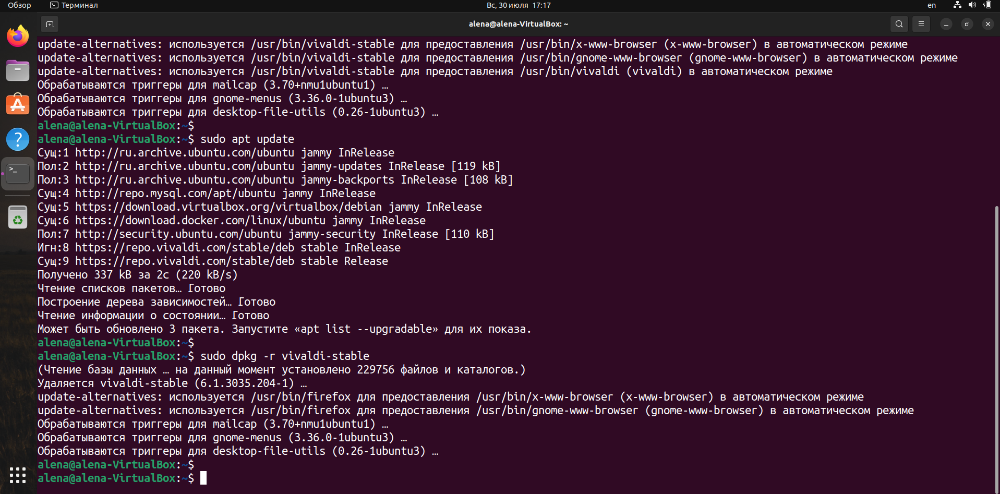

***

5. Выложить историю команд в терминале **ubuntu**.

```
history
```

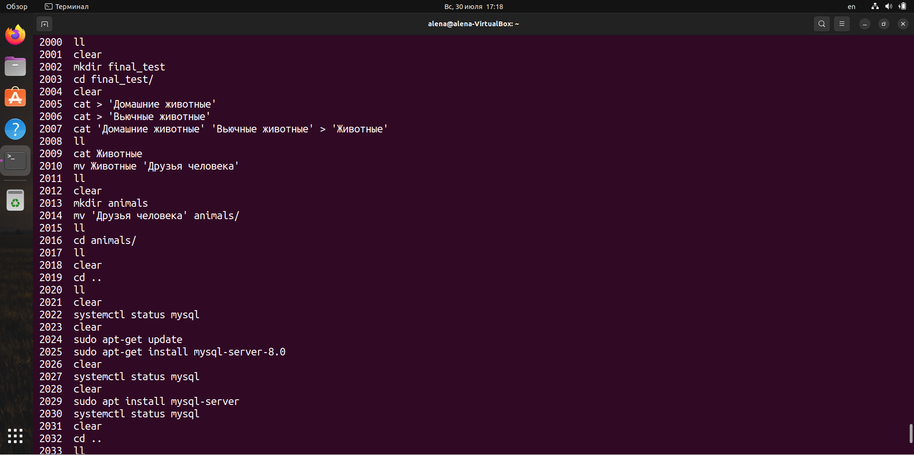

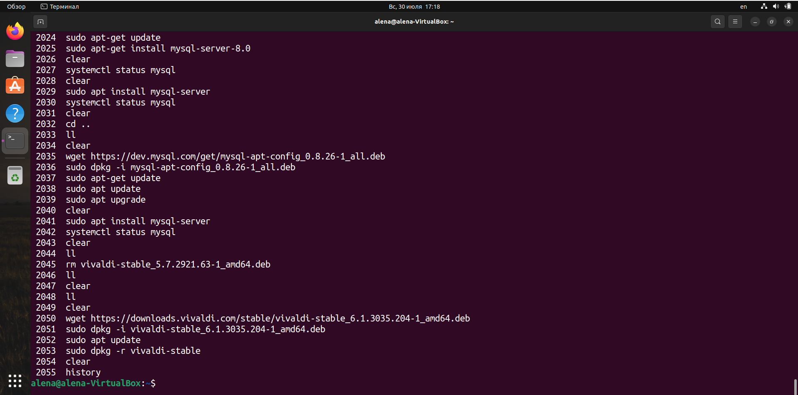

***

6. Нарисовать диаграмму, в которой есть классы: 
    * **родительский класс**, 
    * **домашние животные**,
    * **вьючные животные**, <br>
    
    в составы которых, в случае *домашних животных*, войдут классы: 
    * собаки, 
    * кошки, 
    * хомяки, <br> 
    
    а в класс *вьючные животные*: 
    * лошади, 
    * верблюды,
    * ослы.

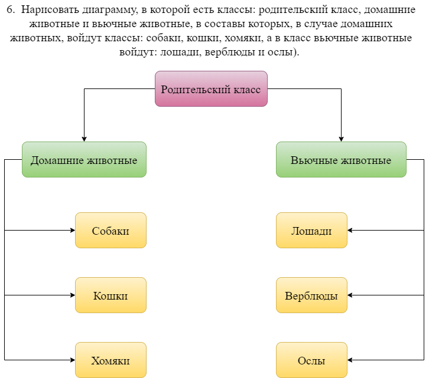

***

7. В подключенном MySQL репозитории создать базу данных **Друзья человека**.

```
CREATE DATABASE Друзья_человека;
```

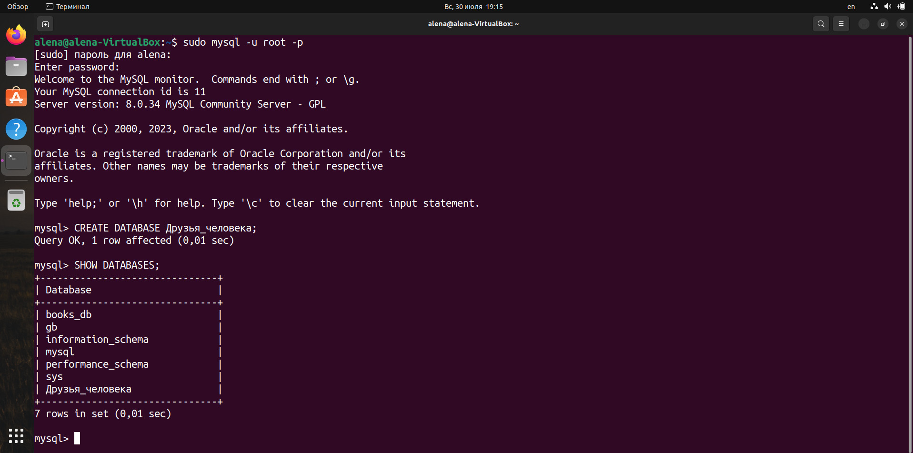

***

8. Создать таблицы с иерархией из диаграммы в БД.

```
CREATE TABLE Родительский_класс (
    id INT PRIMARY KEY AUTO_INCREMENT,
    kind VARCHAR(100) NOT NULL
); 

CREATE TABLE Домашние_животные (
    id INT PRIMARY KEY AUTO_INCREMENT,
    kind VARCHAR(100) NOT NULL,
    parent_id INT NOT NULL,
    FOREIGN KEY (parent_id) REFERENCES Родительский_класс(id)
);

CREATE TABLE Собаки (
    id INT PRIMARY KEY AUTO_INCREMENT,
    name VARCHAR(50) NOT NULL,
    command VARCHAR(200),
    birthday DATE,
    pet_id INT NOT NULL,
    FOREIGN KEY (pet_id) REFERENCES Домашние_животные(id)
);

CREATE TABLE Кошки (
    id INT PRIMARY KEY AUTO_INCREMENT,
    name VARCHAR(50) NOT NULL,
    command VARCHAR(200),
    birthday DATE,
    pet_id INT NOT NULL,
    FOREIGN KEY (pet_id) REFERENCES Домашние_животные(id)
);

CREATE TABLE Хомяки (
    id INT PRIMARY KEY AUTO_INCREMENT,
    name VARCHAR(50) NOT NULL,
    command VARCHAR(200),
    birthday DATE,
    pet_id INT NOT NULL,
    FOREIGN KEY (pet_id) REFERENCES Домашние_животные(id)
);

CREATE TABLE Вьючные_животные (
    id INT PRIMARY KEY AUTO_INCREMENT,
    kind VARCHAR(100) NOT NULL,
    parent_id INT NOT NULL,
    FOREIGN KEY (parent_id) REFERENCES Родительский_класс(id)
);

CREATE TABLE Лошади (
    id INT PRIMARY KEY AUTO_INCREMENT,
    name VARCHAR(50) NOT NULL,
    command VARCHAR(200),
    birthday DATE,
    pack_animal_id INT NOT NULL,
    FOREIGN KEY (pack_animal_id) REFERENCES Вьючные_животные(id)
);

CREATE TABLE Верблюды (
    id INT PRIMARY KEY AUTO_INCREMENT,
    name VARCHAR(50) NOT NULL,
    command VARCHAR(200),
    birthday DATE,
    pack_animal_id INT NOT NULL,
    FOREIGN KEY (pack_animal_id) REFERENCES Вьючные_животные(id)
); 

CREATE TABLE Ослы (
    id INT PRIMARY KEY AUTO_INCREMENT,
    name VARCHAR(50) NOT NULL,
    command VARCHAR(200),
    birthday DATE,
    pack_animal_id INT NOT NULL,
    FOREIGN KEY (pack_animal_id) REFERENCES Вьючные_животные(id)
);
```

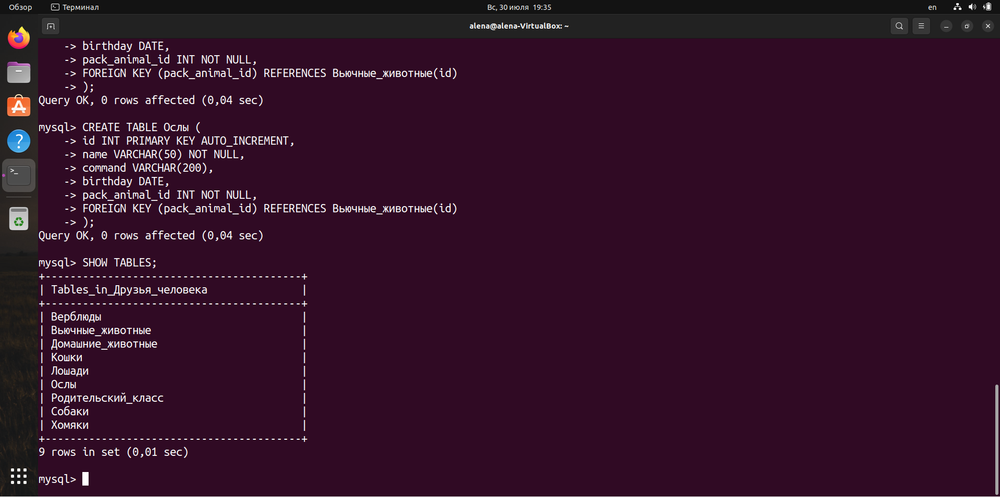

***

9. Заполнить низкоуровневые таблицы именами животных, командами, которые они выполняют, и датами рождения.

```
INSERT INTO Собаки (name, command, birthday, pet_id)
VALUES ('Пушок', 'Голос, Сидеть', '2020-07-06', 1),
    ('Дружок', 'Фу, Рядом, Сидеть', '2017-03-25', 1),
    ('Чарли', 'Лежать', '2021-09-17', 1); 

INSERT INTO Кошки (name, command, birthday, pet_id)
VALUES ('Снежинка', 'Кис-кис', '2023-01-31', 2),
    ('Бублик', 'Кис-кис, Сидеть', '2021-07-24', 2),
    ('Пирожок', 'Кис-кис, Гулять, Нельзя', '2016-05-13', 2); 

INSERT INTO Хомяки (name, command, birthday, pet_id)
VALUES ('Толстяш', 'Играть', '2022-04-20', 3),
    ('Пухляш', 'Играть, Бегать', '2021-12-28', 3);

INSERT INTO Лошади (name, command, birthday, pack_animal_id)
VALUES ('Гроза', 'Но, Стоп', '2018-03-29', 1),
    ('Тпру', 'Шагом, Рысью, Стоп', '2020-06-19', 1),
    ('Но', 'Вперед, Быстрее, Стоять', '2020-11-15', 1); 

INSERT INTO Верблюды (name, command, birthday, pack_animal_id)
VALUES ('Чайна', 'Вперед, Стоять', '2016-07-28', 2),
    ('Ида', 'Вперед, Сидеть, Лежать', '2020-11-03', 2);

INSERT INTO Ослы (name, command, birthday, pack_animal_id)
VALUES ('Иа', 'Сидеть', '2022-02-26', 3),
    ('Орлик', 'Лежать', '2019-06-01', 3),
    ('Люси', 'Сидеть, Рысью', '2020-05-08', 3);
```

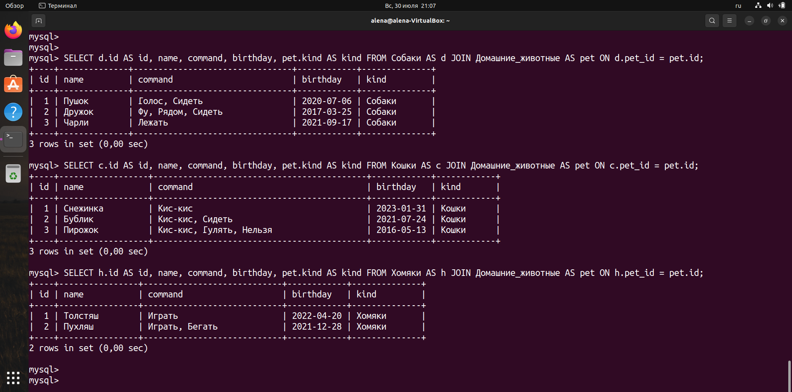

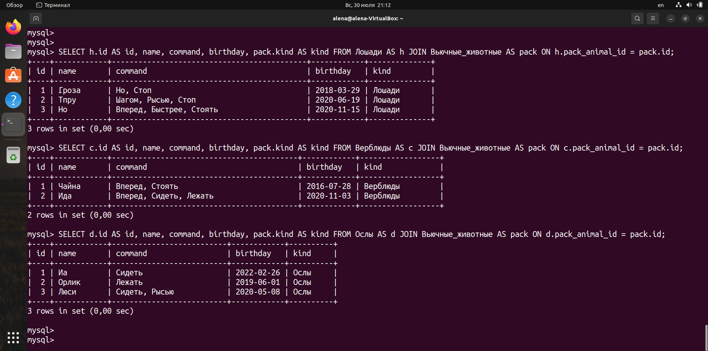

***

10. Удалить из таблицы верблюдов, т.к. их решили перевезти в другой питомник на зимовку. Объединить лошадей и ослов в одну таблицу.

```
TRUNCATE Верблюды;

CREATE TABLE Семейство_лошадиные AS
SELECT * FROM Лошади
UNION
SELECT * FROM Ослы;
```

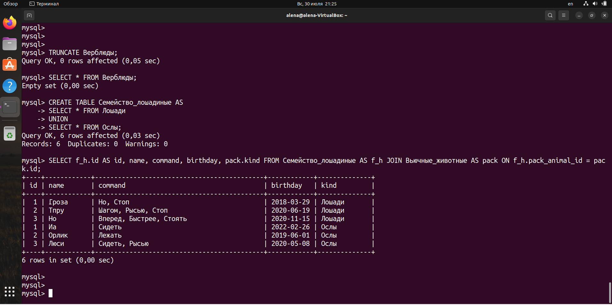

***

11. Создать новую таблицу **Молодые животные**, в которую попадут все
животные старше 1 года, но младше 3 лет и в отдельном столбце с точностью
до месяца подсчитать возраст животных.

```
CREATE TABLE Молодые_животные AS
SELECT *, TIMESTAMPDIFF(MONTH, birthday, CURDATE()) AS age_in_months
FROM (
    SELECT name, command, birthday, pet.kind AS kind 
    FROM Собаки AS dog 
    JOIN Домашние_животные AS pet 
    ON dog.pet_id = pet.id

    UNION ALL

    SELECT name, command, birthday, pet.kind AS kind 
    FROM Кошки AS cat 
    JOIN Домашние_животные AS pet 
    ON cat.pet_id = pet.id

    UNION ALL

    SELECT name, command, birthday, pet.kind AS kind 
    FROM Хомяки AS ham 
    JOIN Домашние_животные AS pet 
    ON ham.pet_id = pet.id

    UNION ALL
    
    SELECT name, command, birthday, pack.kind AS kind 
    FROM Семейство_лошадиные AS f_h 
    JOIN Вьючные_животные AS pack 
    ON f_h.pack_animal_id = pack.id
) AS all_animals
WHERE birthday BETWEEN DATE_SUB(CURDATE(), INTERVAL 3 YEAR) AND DATE_SUB(CURDATE(), INTERVAL 1 YEAR);
```

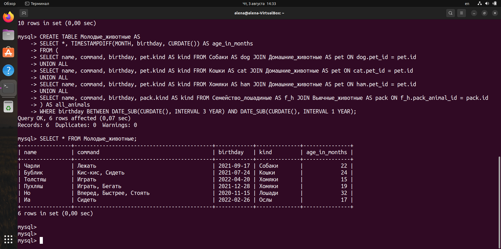

***

12. Объединить все таблицы в одну, при этом сохраняя поля, указывающие на прошлую принадлежность к старым таблицам.

```
CREATE TABLE Все_животные AS
SELECT name, command, birthday, pet.kind AS kind 
FROM Собаки AS dog 
JOIN Домашние_животные AS pet 
ON dog.pet_id = pet.id

UNION ALL

SELECT name, command, birthday, pet.kind AS kind 
FROM Кошки AS cat 
JOIN Домашние_животные AS pet 
ON cat.pet_id = pet.id

UNION ALL

SELECT name, command, birthday, pet.kind AS kind 
FROM Хомяки AS ham 
JOIN Домашние_животные AS pet 
ON ham.pet_id = pet.id

UNION ALL 
SELECT name, command, birthday, pack.kind AS kind 
FROM Лошади AS hor 
JOIN Вьючные_животные AS pack 
ON hor.pack_animal_id = pack.id

UNION ALL

SELECT name, command, birthday, pack.kind AS kind 
FROM Ослы AS don 
JOIN Вьючные_животные AS pack 
ON don.pack_animal_id = pack.id;
```

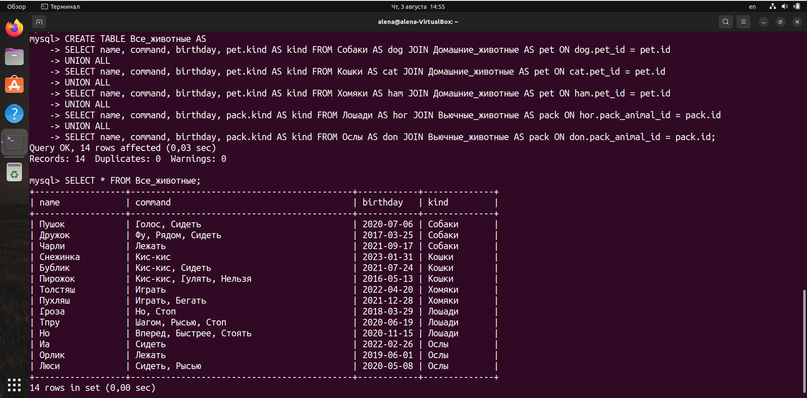

***
